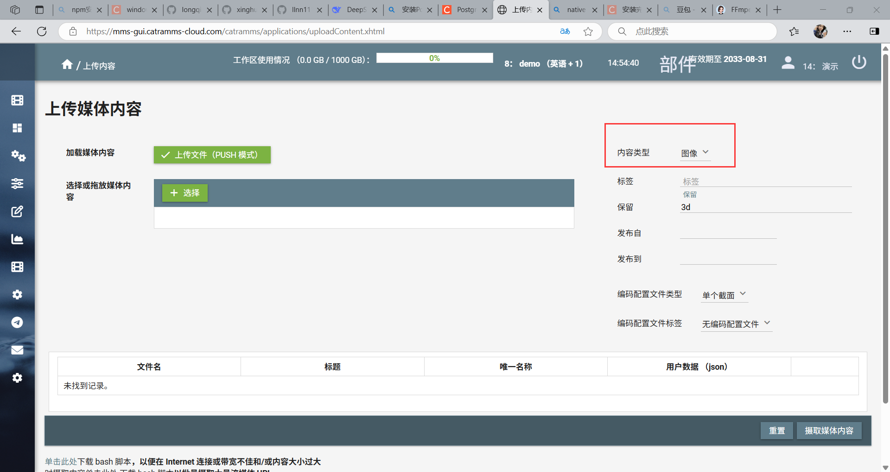

# English Practice
## Features

## Content Ingestion Functionality <!-- by [Long Qingting] -->

CatraMMS provides a flexible content ingestion pipeline supporting multiple ingestion methods:

   1. **Local File Upload**
       Users can upload local files through a simple file picker interface. The script example at `CatraMMS/scripts/examples/ingestOfImage/helper/ingestionWorkflow.sh` demonstrates this operation, requiring users to configure:
       - User/API keys for authentication
       - Metadata (title, tags, retention policy)
       - File format validation

       Command example:
        ```bash
        if [ $# -ne 8 ]; then
        echo "Usage: $0 <mmsUserKey> <mmsAPIKey> <title> <tag> <ingester> <profileset> <retention> <fileFormat> ($#)"
        exit 1
        fi

        mmsAPIHostName=mms-api.cibortv-mms.com
        mmsUserKey=$1
        mmsAPIKey=$2
        title=$3
        tag=$4
        ingester=$5
        profileSet=$6
        retention=$7
        fileFormat=$8

        sed "s/\${title}/$title/g" ./helper/ingestionWorkflow.json | sed "s/\${tag}/$tag/g" | sed "s/\${ingester}/$ingester/g" | sed "s/\${profileSet}/$profileSet/g" | sed "s/\${retention}/$retention/g" | sed "s/\${fileFormat}/$fileFormat/g" > ./helper/ingestionWorkflow.json.new

        responseCode=$(curl -o ./helper/ingestionWorkflowResult.json -w "%{response_code}" -k -s -X POST -u $mmsUserKey:$mmsAPIKey -d @./helper/ingestionWorkflow.json.new -H "Content-Type: application/json" https://$mmsAPIHostName/catramms/1.0.1/workflow)
        if [ "$responseCode" -ne "201" ]; then
             echo "$(date +%Y-%m-%d-%H:%M:%S): FAILURE, Ingestion response code: $responseCode"
             exit 2
        fi

        rm ./helper/ingestionWorkflow.json.new

        #print ingestionJobKey
        jq '.tasks[] | select(.type == "Add-Content") | .ingestionJobKey' ./helper/ingestionWorkflowResult.json
        
        


    2. **Cloud Storage Integration**
        Supports direct content import from third-party cloud providers (e.g., Google Drive, Dropbox) via sourceURL configuration. While no specific cloud SDKs are used, the system supports fetching content from external storage URLs:

        json
        "parameters": {
            "sourceURL": "http://myhost/example.mp4",  // Supports HTTP/HTTPS/FTP/FTPS protocols
            // ...
        }


    3. **Batch Import**
        Allows users to import multiple files at once, supporting various file formats. The script at CatraMMS/scripts/examples/ingestionOfStreamingURL/ingestionOfStreamingURL.sh demonstrates batch import by processing files containing multiple titles and streaming URLs sequentially:

        bash
        if [ $# -lt 8 ]; then
            echo "Usage: $0 <mmsUserKey> <mmsAPIKey> <tag> <ingester> <retention> <encodersPool> <encodingProfilesSet> <streamingURLFile>"
            echo "The current parameters number is: $#, it shall be 9"
            paramIndex=1
            for param in "$@"
            do
                echo "Param #$paramIndex: $param";
                paramIndex=$((paramIndex + 1));
            done
            exit 1
        fi

        mmsUserKey=$1
        mmsAPIKey=$2
        tag=$3
        ingester=$4
        retention=$5
        encodersPool=$6
        encodingProfilesSet=$7
        streamingURLFile=$8

        mmsAPIHostName=mms-api.catramms-cloud.com

        while read titleAndtreamingURL; do
            if [ "$titleAndtreamingURL" = "" ]; then
                continue
            fi

        title=$(echo $titleAndtreamingURL | cut -d ";" -f 1)
        streamingURL=$(echo $titleAndtreamingURL | cut -d ";" -f 2)
        encodedStreamingURL=${streamingURL//\//"\\/"}
        encodedStreamingURL=${encodedStreamingURL//\&/"\\&"}

        sed "s/\${title}/$title/g" ./helper/ingestionWorkflow.json | sed "s/\${streamingURL}/$encodedStreamingURL/g" | sed "s/\${tag}/$tag/g" | sed "s/\${ingester}/$ingester/g" | sed "s/\${retention}/$retention/g" | sed "s/\${encodersPool}/$encodersPool/g" | sed "s/\${encodingProfilesSet}/$encodingProfilesSet/g" > ./helper/ingestionWorkflow.json.new
        curl -o ./helper/ingestionWorkflowResult.json -k -s -X POST -u $mmsUserKey:$mmsAPIKey -d @./helper/ingestionWorkflow.json.new -H "Content-Type: application/json" https://$mmsAPIHostName/catramms/1.0.1/workflow
        done < "$streamingURLFile"
        
        

    4. **Automated Ingestion**
        Implements scheduled ingestion through:

        Filesystem monitoring: Initially designed using incrontab (inotify-based), later adapted to use cron-triggered scripts due to mounted directory limitations
        Watch folder pattern: Periodically scans designated directories for new files


## Content Handling Capability <!-- by [Long Qingting] -->

   1. **Multimedia Format Transcoding**
       The system provides professional media transcoding services, supporting conversion between various video container formats, including but not limited to transcoding source files into standardized container formats such as MP4 and AVI. In the CatraMMS/API/src/FFMPEGEncoderTask.cpp implementation, the downloadMediaFromMMS function establishes a complete transcoding pipeline, specifically designed to handle the download and transcoding process of streaming media content based on the HLS protocol, efficiently converting .m3u8 playlist format streaming content into industry-standard MP4 container format.

       cpp
       string FFMPEGEncoderTask::downloadMediaFromMMS(
           int64_t ingestionJobKey, int64_t encodingJobKey, shared_ptr<FFMpegWrapper> ffmpeg, string sourceFileExtension, string sourcePhysicalDeliveryURL,
           string destAssetPathName
       )
       {
           string localDestAssetPathName = destAssetPathName;
           bool isSourceStreaming = false;
           if (sourceFileExtension == ".m3u8")
             isSourceStreaming = true;

       if (isSourceStreaming)
       {
            bool regenerateTimestamps = false;
            localDestAssetPathName = localDestAssetPathName + ".mp4";
            ffmpeg->streamingToFile(ingestionJobKey, regenerateTimestamps, sourcePhysicalDeliveryURL, localDestAssetPathName);
       }
       else
       {
            FFMpegProgressData progressData;
            progressData._ingestionJobKey = ingestionJobKey;
            progressData._lastTimeProgressUpdate = chrono::system_clock::now();
            progressData._lastPercentageUpdated = -1.0;

            CurlWrapper::downloadFile(
                sourcePhysicalDeliveryURL, localDestAssetPathName, progressDownloadCallback2, &progressData, 500,
                std::format(", ingestionJobKey: {}", ingestionJobKey),
                3 // maxRetryNumber
            );
       }

        return localDestAssetPathName;
       }
       

   2. **Media File Compression**
       Allowing users to employ codecs for performing lossy/lossless compression on image (JPEG/PNG) and video (H.264/HEVC) files, significantly reducing bitrate and file size. Although the current codebase does not explicitly contain compression algorithm implementations, the system leverages the FFmpeg multimedia framework, utilizing its built-in libx264/libx265 encoders, CRF (Constant Rate Factor) quality control parameters, and preset systems to achieve efficient transcoding workflows. Developers can optimize rate-distortion (R-D) performance by adjusting quantization parameters (QP), GOP (Group of Pictures) structure, and other professional video encoding parameters.

       Take general compression (H.264 + AAC, balancing image quality and file size) as an example:

       bash
       ffmpeg -i Guangwai.mp4 -c:v libx264 -crf 23 -preset medium -c:a aac -b:a 128k Guangwai_compressed.mp4

   3. **Metadata Extraction**
       The system automatically extracts file metadata (e.g., title, author, creation date) and stores it in a database to facilitate subsequent management and retrieval. In the buildAddContentIngestionWorkflow function located in CatraMMS/API/src/FFMPEGEncoderTask.cpp, the system processes JSON objects containing metadata. The extracted metadata can be stored within these objects, enabling efficient content management and querying capabilities.
       cpp
       string FFMPEGEncoderTask::buildAddContentIngestionWorkflow(
            int64_t ingestionJobKey, string label, string fileFormat, string ingester,
            string sourceURL, string title, json userDataRoot,
            json ingestedParametersRoot, int64_t encodingProfileKey,
            int64_t variantOfMediaItemKey
       )
       {
            json addContentRoot;
            string field = "label";
            addContentRoot[field] = label;
            field = "type";
            addContentRoot[field] = "Add-Content";

            son addContentParametersRoot;

            // ... 处理元数据相关逻辑

            if (userDataRoot != nullptr)
            {
            field = "userData";
            addContentParametersRoot[field] = userDataRoot;
            }

            // ...

            return JSONUtils::toString(workflowRoot);
       }

   4. **Batch Processing**
        Supports simultaneous processing of multiple files to enhance workflow efficiency. Integrated with the aforementioned batch import functionality, after importing multiple files, users can perform batch operations such as format conversion, compression, and metadata extraction. Leveraging scripting loops and concurrency mechanisms, the system enables parallel processing of multiple files. For instance, in CatraMMS/scripts/examples/ingestionOfStreamingURL/ingestionOfStreamingURL.sh, the script reads a file containing multiple content entries and sequentially ingests and processes each item, significantly improving overall operational efficiency.
