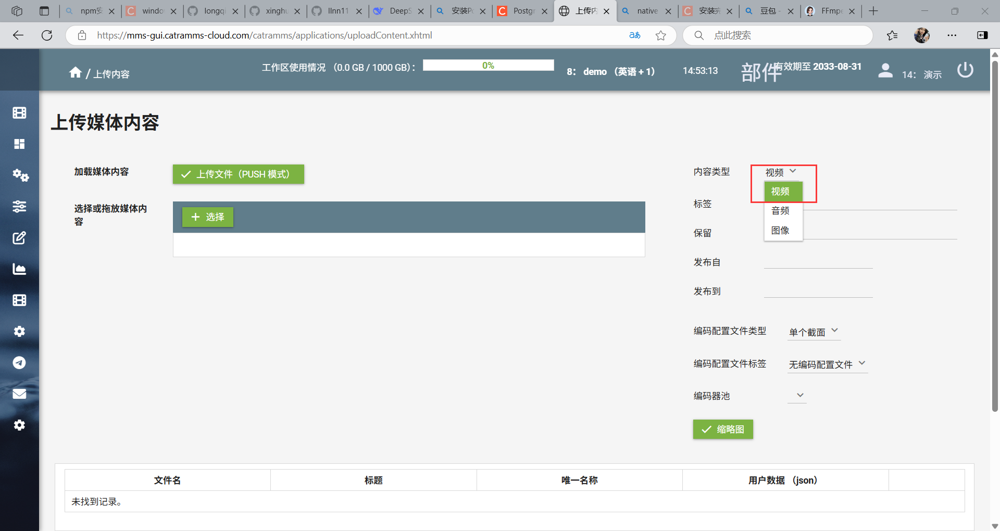

# English-practice
## 功能特性

## 内容摄入功能 <!-- by [龙青蜓] -->

CatraMMS 提供了一套灵活的内容摄入管道，支持多种内容摄入方式：

1. **本地文件上传**：用户可以通过简单的文件选择界面上传本地文件。在脚本示例中，如 CatraMMS/scripts/examples/ingestOfImage/helper/ingestionWorkflow.sh 展示了相关操作，用户需要配置：用于身份验证的用户/API密钥、元数据（标题、标签、保留策略）、文件格式验证。具体命令如下：
if [ $# -ne 8 ]; then
    echo "Usage: $0 <mmsUserKey> <mmsAPIKey> <title> <tag> <ingester> <profileset> <retention> <fileFormat> ($#)"
    exit 1
fi

mmsAPIHostName=mms-api.cibortv-mms.com
mmsUserKey=$1
mmsAPIKey=$2
title=$3
tag=$4
ingester=$5
profileSet=$6
retention=$7
fileFormat=$8

sed "s/\${title}/$title/g" ./helper/ingestionWorkflow.json | sed "s/\${tag}/$tag/g" | sed "s/\${ingester}/$ingester/g" | sed "s/\${profileSet}/$profileSet/g" | sed "s/\${retention}/$retention/g" | sed "s/\${fileFormat}/$fileFormat/g" > ./helper/ingestionWorkflow.json.new

responseCode=$(curl -o ./helper/ingestionWorkflowResult.json -w "%{response_code}" -k -s -X POST -u $mmsUserKey:$mmsAPIKey -d @./helper/ingestionWorkflow.json.new -H "Content-Type: application/json" https://$mmsAPIHostName/catramms/1.0.1/workflow)
if [ "$responseCode" -ne "201" ]; then
    echo "$(date +%Y-%m-%d-%H:%M:%S): FAILURE, Ingestion response code: $responseCode"
    exit 2
fi

rm ./helper/ingestionWorkflow.json.new

#print ingestionJobKey
jq '.tasks[] | select(.type == "Add-Content") | .ingestionJobKey' ./helper/ingestionWorkflowResult.json

2. **云存储集成**：支持通过sourceURL配置从第三方云服务提供商（如Google Drive、Dropbox）直接导入内容。虽然未使用特定的云SDK，但系统支持通过外部存储URL获取内容：
"parameters": {
    "sourceURL": "http://myhost/example.mp4",  // 支持HTTP/HTTPS/FTP/FTPS协议
    // ...
}

3. **批量导入**：允许用户一次性导入多个文件，支持多种文件格式。CatraMMS/scripts/examples/ingestionOfStreamingURL/ingestionOfStreamingURL.sh 脚本展示了批量导入的思路，通过读取包含多个标题和流媒体 URL 的文件，依次对每个内容进行摄入操作：
if [ $# -lt 8 ]; then
    echo "Usage: $0 <mmsUserKey> <mmsAPIKey> <tag> <ingester> <retention> <encodersPool> <encodingProfilesSet> <streamingURLFile>"
    echo "The current parameters number is: $#, it shall be 9"
    paramIndex=1
    for param in "$@"
    do
        echo "Param #$paramIndex: $param";
        paramIndex=$((paramIndex + 1));
    done
    exit 1
fi

mmsUserKey=$1
mmsAPIKey=$2
tag=$3
ingester=$4
retention=$5
encodersPool=$6
encodingProfilesSet=$7
streamingURLFile=$8

mmsAPIHostName=mms-api.catramms-cloud.com

while read titleAndtreamingURL; do
    if [ "$titleAndtreamingURL" = "" ]; then
        continue
    fi

    title=$(echo $titleAndtreamingURL | cut -d ";" -f 1)
    streamingURL=$(echo $titleAndtreamingURL | cut -d ";" -f 2)
    encodedStreamingURL=${streamingURL//\//"\\/"}
    encodedStreamingURL=${encodedStreamingURL//\&/"\\&"}

    sed "s/\${title}/$title/g" ./helper/ingestionWorkflow.json | sed "s/\${streamingURL}/$encodedStreamingURL/g" | sed "s/\${tag}/$tag/g" | sed "s/\${ingester}/$ingester/g" | sed "s/\${retention}/$retention/g" | sed "s/\${encodersPool}/$encodersPool/g" | sed "s/\${encodingProfilesSet}/$encodingProfilesSet/g" > ./helper/ingestionWorkflow.json.new
    curl -o ./helper/ingestionWorkflowResult.json -k -s -X POST -u $mmsUserKey:$mmsAPIKey -d @./helper/ingestionWorkflow.json.new -H "Content-Type: application/json" https://$mmsAPIHostName/catramms/1.0.1/workflow
done < "$streamingURLFile"

4. **自动化摄入**：通过以下方式实现定时摄入：
文件系统监控：最初设计使用incrontab（基于inotify），后因挂载目录限制改用cron触发的脚本。
监视文件夹模式：定期扫描指定目录中的新文件。

## 内容处理功能 <!-- by [龙青蜓] -->

CatraMMS 提供强大的内容处理功能，以满足用户的多样化需求：

1. **多媒体格式转换功能**：本系统提供专业的媒体转码服务，支持多种视频容器格式间的相互转换，包括但不限于将源文件转码为MP4、AVI等标准化容器格式。在CatraMMS/API/src/FFMPEGEncoderTask.cpp实现中，downloadMediaFromMMS函数构建了完整的转码流水线，该函数专门处理基于HLS协议的流媒体内容下载与转码过程，实现将.m3u8播放列表格式的流媒体内容高效转码为符合行业标准的MP4容器格式。
string FFMPEGEncoderTask::downloadMediaFromMMS(
    int64_t ingestionJobKey, int64_t encodingJobKey, shared_ptr<FFMpegWrapper> ffmpeg, string sourceFileExtension, string sourcePhysicalDeliveryURL,
    string destAssetPathName
)
{
    string localDestAssetPathName = destAssetPathName;
    bool isSourceStreaming = false;
    if (sourceFileExtension == ".m3u8")
        isSourceStreaming = true;

    if (isSourceStreaming)
    {
        bool regenerateTimestamps = false;
        localDestAssetPathName = localDestAssetPathName + ".mp4";
        ffmpeg->streamingToFile(ingestionJobKey, regenerateTimestamps, sourcePhysicalDeliveryURL, localDestAssetPathName);
    }
    else
    {
        FFMpegProgressData progressData;
        progressData._ingestionJobKey = ingestionJobKey;
        progressData._lastTimeProgressUpdate = chrono::system_clock::now();
        progressData._lastPercentageUpdated = -1.0;

        CurlWrapper::downloadFile(
            sourcePhysicalDeliveryURL, localDestAssetPathName, progressDownloadCallback2, &progressData, 500,
            std::format(", ingestionJobKey: {}", ingestionJobKey),
            3 // maxRetryNumber
        );
    }

    return localDestAssetPathName;
}

2. **媒体文件压缩**：用户可通过调用编解码器对图像(JPEG/PNG)和视频(H.264/HEVC)文件执行有损/无损压缩，显著降低媒体文件的比特率和体积。虽然当前代码库未显式包含压缩算法实现，但系统通过集成FFmpeg多媒体框架，可利用其内置的libx264/libx265编码器、CRF(Constant Rate Factor)质量控制参数以及预设系统实现高效的转码流程。开发者可通过调整量化参数(QP)、GOP(Group of Pictures)结构等专业视频编码参数来优化率失真(R-D)性能。
通用压缩（H.264 + AAC，平衡画质和体积）为例：
ffmpeg -i 广外.mp4 -c:v libx264 -crf 23 -preset medium -c:a aac -b:a 128k 广外_compressed.mp4

3. **元数据提取**：系统自动提取文件的元数据（如标题、作者、创建日期等），并将其存储于数据库中，以便于后续的集中化管理与高效检索。在 CatraMMS/API/src/FFMPEGEncoderTask.cpp 中的 buildAddContentIngestionWorkflow 函数中，系统会处理包含元数据的 JSON 对象。提取的元数据可存储于这些对象中，为内容管理与检索提供支持。
string FFMPEGEncoderTask::buildAddContentIngestionWorkflow(
    int64_t ingestionJobKey, string label, string fileFormat, string ingester,
    string sourceURL, string title, json userDataRoot,
    json ingestedParametersRoot, int64_t encodingProfileKey,
    int64_t variantOfMediaItemKey
)
{
    json addContentRoot;
    string field = "label";
    addContentRoot[field] = label;
    field = "type";
    addContentRoot[field] = "Add-Content";

    json addContentParametersRoot;
    // ... 处理元数据相关逻辑
    if (userDataRoot != nullptr)
    {
        field = "userData";
        addContentParametersRoot[field] = userDataRoot;
    }
    // ...
    return JSONUtils::toString(workflowRoot);
}

4. **批量处理**：支持对多个文件进行并行处理，以提升工作流效率。结合前文提到的批量导入功能，在导入多个文件后，用户可执行批量操作，如格式转换、压缩及元数据提取等。通过脚本循环和并发机制，系统能够实现多文件的同步处理。例如，在 CatraMMS/scripts/examples/ingestionOfStreamingURL/ingestionOfStreamingURL.sh 中，脚本读取包含多条内容信息的文件，并依次对每条内容执行摄入及后续处理，从而显著提升整体工作效率。
