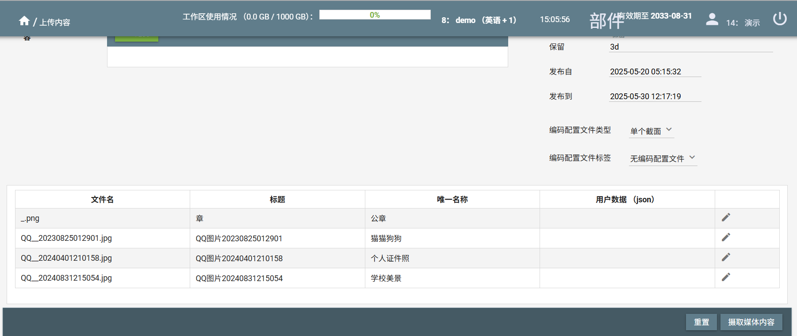
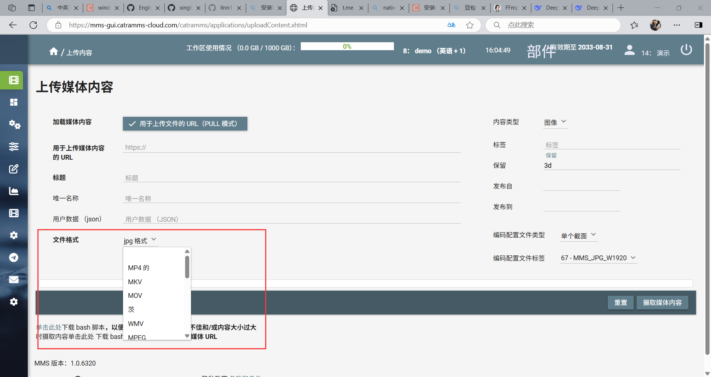

<!-- by 韦柔 -->
# 内容编码功能


## 1. 视频编码

### 1.1 功能概述
CatraMMS的视频编码功能提供灵活的配置选项，支持多种格式和参数设置。

### 1.2 用户配置
系统通过预设配置文件和API接口管理视频编码。用户可通过界面配置包括以下参数：
- 编解码器（如libx264）
- 配置文件（如high422/main）
- 比特率
- 帧率
- 分辨率

### 1.3 核心实现
关键功能实现在`API/src/API_Encoding.cpp`中，包含以下核心函数：
- `addEncodingProfile()`
- `removeEncodingProfile()`


### 1.4 预设配置
预定义的视频编码配置以JSON格式存储在`predefinedEncodingProfiles/video/`目录下。

### 1.5 支持格式
系统支持的容器格式包括：
- MP4
- DASH
- TS

并提供针对不同使用场景优化的预设比特率-分辨率组合。


## 2. 音频编码

### 2.1 模块灵活性
音频编码模块既可独立运行，也可与视频编码协同工作。

### 2.2 核心编解码器
系统采用AAC作为核心音频编解码器，提供92kbps至160kbps的可配置比特率（如视频编码配置中的AAC_160）。

### 2.3 配置存储
预定义的音频编码配置以JSON格式存储在`predefinedEncodingProfiles/audio/`目录下。

### 2.4 高级处理
专业音频处理功能包括：
- 响度标准化
- 噪声抑制
- 智能分段编码（特别适合播客和音乐制作）

### 2.5 多声道支持
多声道音频支持可处理专业格式（如5.1环绕声），满足高标准媒体制作需求。


## 3. 图像编码

### 3.1 核心功能
系统支持主流格式转换和智能压缩功能。

### 3.2 预设模板
提供名为"MMS_JPEG_85Q_1920x1080"的预设模板，指定：
- 质量参数（85Q）
- 分辨率设置

### 3.3 配置存储
预定义的图像编码配置以JSON格式存储在`predefinedEncodingProfiles/image/`目录下。

### 3.4 优化功能
关键优化包括：
- 渐进式加载
- 自适应格式选择（针对网页）
- 自动多分辨率生成（针对移动设备）

### 3.5 专业特性
图像处理引擎支持：
- 元数据保留
- 自动方向校正
- 批量图像文件处理

显著提升内容管理效率。


# 通知功能

CatraMMS的通知功能主要通过电子邮件实现用户与系统支持团队之间的沟通。

如操作界面截图所示，系统提供简洁的表单要求用户填写：
- 电子邮箱地址
- 邮件主题
- 消息内容

并支持发送邮件至指定邮箱。

## 实现组件
1. 前端界面收集用户输入的邮件信息
2. 后端处理逻辑负责实际邮件传输
3. 系统使用SMTP协议与邮件服务器通信


# 安全功能

## 1. 身份认证  
CatraMMS 项目通过电子邮箱、密码等方式验证用户身份，确保只有授权用户可访问系统。  
在用户注册和确认流程中，严格把控用户身份的合法性。  

如 `confirmRegistration` 函数：该函数用于确认用户的注册信息，只有通过确认的用户才能正式使用系统，进一步保证了系统的安全性。  


## 2. 权限管理  
系统根据用户角色和权限限制对媒体内容的访问和操作。  
不同角色的用户具有不同的权限，确保只有授权用户可以进行特定的操作。  

在 `CatraMMS/API/src/API_UserWorkspace.cpp` 文件中的 `createWorkspace` 函数中，会根据用户的权限判断是否可以创建工作空间。  

## 3. 数据加密  
- 项目对系统中存储的媒体内容进行加密，防止存储期间数据被盗。  
- 在媒体内容传输过程中使用 SSL/TLS 等加密协议，确保传输安全。  

## 4. 日志与审计  
- 项目记录关键系统操作和访问日志，在发生安全事件时支持审计和追踪。  
- 通过详细的日志记录，可以及时发现异常操作并进行处理。  

`SPDLOG_INFO` 和 `SPDLOG_ERROR` 宏：在多个文件中都有使用，例如 `CatraMMS/API/src/API_UserWorkspace.cpp` 文件。这些宏用于记录系统的关键信息和错误信息，方便后续的审计和追踪。  
<!-- by 韦柔 -->
=======

<!-- by 梁梅 -->

# CatraMMS 人脸识别功能使用教程

## 一、数据准备阶段  
1. 参考数据入库  
   操作目的：建立人脸特征比对库。  
   步骤说明：  
     1. 通过媒体管理接口上传参考人脸图像或视频片段至媒体库。 


     2. 系统返回该数据的唯一标识符 。

     3. 在元数据中标注 deepLearnedModelTags，与预训练深度学习模型关联。  

2. 输入流注册  
   -操作目的：定义待识别视频源。  
   步骤说明：  
     1. 注册目标视频流或文件至系统，获取其 configurationLabel。  
     2. 验证流协议兼容性（支持 RTMP、HLS、HTTP-FLV 等）。  

## 二、任务配置阶段  
写个任务单子：
   

## 三、任务提交与执行阶段  
1. API 任务提交  
   操作目的：触发异步处理流水线。  
   步骤说明：  
     1. 调用 POST /api/tasks接口提交任务配置文件。  
     2. 系统返回encodingJobKey用于状态追踪。   

2. 任务队列调度  
   系统行为：  
     1. 任务进入分布式任务队列，由负载均衡模块分配至可用计算节点。  
     2. 节点加载预训练模型（如 FaceNet、ResNet）及级联分类器文件（.xml）。  


# CatraMMS 人脸身份识别功能使用教程

## 一、数据准备与注册  
1. 参考数据入库  
   操作目的：构建身份特征库以实现精准匹配。  
   步骤说明：  
     1. 通过媒体管理接口上传目标身份的人脸图像或视频片段至媒体库。  
     2. 系统返回该数据的唯一标识符 。  
     3. 在元数据中绑定deepLearnedModelTags，与预训练的深度学习模型（如 FaceNet、ArcFace）关联。  

2. 输入流/文件注册  
   操作目的：定义待识别的视频源或实时流。  
   步骤说明：  
     1. 注册目标视频流（如 RTMP、HLS）或文件至系统，获取其 configurationLabel。  
     2. 验证流协议兼容性及稳定性（支持断线重连与动态缓冲）。  

## 二、任务提交与执行  
1. 通过 API 提交任务  
   操作目的：触发异步处理流水线。  
   步骤说明：  
     1. 调用 POST /api/tasks 接口提交任务配置文件。  
     2. 系统返回 encodingJobKey用于状态追踪及后续操作。  

2. 分布式任务调度  
   系统行为：  
     1. 任务进入优先级任务队列，由调度引擎分配至可用计算节点。  
     2. 节点加载预训练模型（如 ResNet-100）及级联分类器文件（.xml）。  
     3. 初始化 GPU 加速上下文（若配置 CUDA）。  

## 三、核心处理流程  
1. 人脸检测（Face Detection）  
   技术实现：  
     使用 Haar/LBP 级联分类器逐帧执行多尺度滑动窗口检测。  
    
2. 结果生成与持久化  
   输出类型：  
     可视化视频：在检测区域叠加边界框（Bounding Box）、身份标签及置信度。  
     结构化元数据：生成 JSON 文件，记录时间戳、坐标、标签、置信度及匹配状态。  
     
# CatraMMS 直播网格功能使用教程

## 一、输入流准备与注册  
1. 定义输入流源  
   操作目的：明确待合成的多路直播流源及其技术参数。  
   步骤说明：  
     1. 通过流管理接口注册每路直播流，记录其协议（RTMP、SRT、HLS）、分辨率、帧率及编解码格式。  
     2. 为每路流分配唯一configurationLabel（如 conf-stream-1、conf-stream-2）。  
     3. 验证输入流的稳定性（缓冲策略、重连机制）及协议兼容性。  

2. 编码预设配置  
   操作目的：定义输出流的编码参数以平衡质量与带宽。  

## 二、任务提交与执行  
1. API 任务提交  
   操作目的：触发分布式合成流水线。  
   步骤说明：  
     1. 调用 POST /api/tasks接口提交任务配置文件。  
     2. 系统返回 encodingJobKey及初始状态（queued 或 running）。  
   
2. 任务调度与资源分配  
   系统行为：  
     1. 任务进入优先级任务队列，由调度引擎分配至负载最低的计算节点。  
     2. 节点初始化 FFmpeg 实例，加载输入流并绑定滤镜链（xstack 或 grid 滤镜）。  
     3. 按配置参数动态合成网格布局，启用硬件加速（如 NVIDIA NVENC 或 Intel QSV）。  

## 三、核心处理流程  
1. 流输入与解码  
   技术实现：  
     通过 FFmpeg 的 libavformat解复用输入流，提取音视频裸数据。  
     支持动态缓冲（Jitter Buffer）以应对网络抖动，确保流同步。  

2. 网格布局合成  
   滤镜链配置：  
     使用 scale滤镜统一子画面分辨率（如 960x540）。  
     通过 xstack滤镜定义布局（例如 layout=0_0|w0_0 表示水平排列）。  
   
3. 编码与推流  
   技术实现：  
     调用预设编码器压缩合成后的视频流。  
     通过 librtmp 或 libsrt 推送至目标 CDN 或媒体服务器。  

# CatraMMS 直播录制功能使用教程

## 一、输入流配置与注册 
1. 直播流定义与协议验证  
   操作目的：确保待录制流源的稳定性与兼容性。  
   步骤说明：  
     1. 通过流管理接口注册直播流，指定协议（如 RTMP、HLS、SRT）、分辨率、帧率及编码格式（H.264/H.265）。  
     2. 分配唯一标识符，用于后续任务绑定。  
     3. 验证输入流连通性，配置动态缓冲策略（Jitter Buffer）以应对网络抖动。  

2. 存储路径规划  
   操作目的：定义录制文件的持久化存储位置及保留策略。  
   步骤说明：  
     1. 在 predefinedEncodingProfiles/storage.json中配置本地存储路径（如 /mnt/recordings/）或云存储端点（如 AWS S3、阿里云 OSS）。  
     2. 设置文件保留周期（如 retentionDays: 30）及自动清理规则（LRU 或时间触发）。  

## 二、任务参数配置与初始化  
1. JSON 任务配置文件定义    
  

## 三、任务提交与自动化执行  
1. API 任务提交  
   操作目的：触发录制流水线并分配资源。  
   步骤说明：  
     1. 调用POST /api/tasks接口提交任务配置文件，系统返回encodingJobKey。  
     2. 任务进入分布式任务队列，由调度引擎分配至最优计算节点。  

2. 实时流处理与录制  
   技术实现：  
     1. 初始化 FFmpeg 实例，通过 libavformat解复用输入流，提取音视频数据包。  
     2. 按配置分段规则（时间或大小）生成独立文件，写入指定存储路径。  
     3. 动态处理输入流中断：  
        重连机制：最大重试次数（默认5次），超时阈值（如10秒）。  
        断点续录：记录最后有效时间戳，恢复后自动衔接录制。  

## 四、任务监控与状态管理  
1. 实时状态查询  
   响应内容：  
     任务状态（running、paused、completed、error）。  
     正在写入的分段文件路径。  
     错误详情（如输入流中断、存储写入失败）。  


# English-practice
## 功能特性

## 内容摄入功能 <!-- by 龙青蜓 -->

CatraMMS 提供了一套灵活的内容摄入管道，支持多种内容摄入方式：

1. **本地文件上传**
    用户可以通过简单的文件选择界面上传本地文件。在脚本示例中，如 CatraMMS/scripts/examples/ingestOfImage/helper/ingestionWorkflow.sh 展示了相关操作，用户需要配置：
    用于身份验证的用户/API密钥
    元数据（标题、标签、保留策略）
    文件格式验证


    具体命令如下：
    ```bash
      if [ $# -ne 8 ]; then
          echo "Usage: $0 <mmsUserKey> <mmsAPIKey> <title> <tag> <ingester> <profileset> <retention> <fileFormat> ($#)"
          exit 1
      fi

      mmsAPIHostName=mms-api.cibortv-mms.com
      mmsUserKey=$1
      mmsAPIKey=$2
      title=$3
      tag=$4
      ingester=$5
      profileSet=$6
      retention=$7
      fileFormat=$8

      sed "s/\${title}/$title/g" ./helper/ingestionWorkflow.json | sed "s/\${tag}/$tag/g" | sed "s/\${ingester}/$ingester/g" | sed "s/\${profileSet}/$profileSet/g" | sed "s/\${retention}/$retention/g" | sed "s/\${fileFormat}/$fileFormat/g" > ./helper/ingestionWorkflow.json.new

      responseCode=$(curl -o ./helper/ingestionWorkflowResult.json -w "%{response_code}" -k -s -X POST -u $mmsUserKey:$mmsAPIKey -d @./helper/ingestionWorkflow.json.new -H "Content-Type: application/json" https://$mmsAPIHostName/catramms/1.0.1/workflow)
      if [ "$responseCode" -ne "201" ]; then
          echo "$(date +%Y-%m-%d-%H:%M:%S): FAILURE, Ingestion response code: $responseCode"
          exit 2
      fi

      rm ./helper/ingestionWorkflow.json.new

      #print ingestionJobKey
      jq '.tasks[] | select(.type == "Add-Content") | .ingestionJobKey' ./helper/ingestionWorkflowResult.json```
 


2. **云存储集成**
    支持通过sourceURL配置从第三方云服务提供商（如Google Drive、Dropbox）直接导入内容。虽然未使用特定的云SDK，但系统支持通过外部存储URL获取内容：
      ```json
      "parameters": {
          "sourceURL": "http://myhost/example.mp4",  // 支持HTTP/HTTPS/FTP/FTPS协议
          // ...
      }```


3. **批量导入**
    允许用户一次性导入多个文件，支持多种文件格式。CatraMMS/scripts/examples/ingestionOfStreamingURL/ingestionOfStreamingURL.sh 脚本展示了批量导入的思路，通过读取包含多个标题和流媒体 URL 的文件，依次对每个内容进行摄入操作：
      ```bash
      if [ $# -lt 8 ]; then
          echo "Usage: $0 <mmsUserKey> <mmsAPIKey> <tag> <ingester> <retention> <encodersPool> <encodingProfilesSet> <streamingURLFile>"
          echo "The current parameters number is: $#, it shall be 9"
          paramIndex=1
          for param in "$@"
          do
              echo "Param #$paramIndex: $param";
              paramIndex=$((paramIndex + 1));
          done
          exit 1
      fi

      mmsUserKey=$1
      mmsAPIKey=$2
      tag=$3
      ingester=$4
      retention=$5
      encodersPool=$6
      encodingProfilesSet=$7
      streamingURLFile=$8

      mmsAPIHostName=mms-api.catramms-cloud.com

      while read titleAndtreamingURL; do
          if [ "$titleAndtreamingURL" = "" ]; then
              continue
          fi

          title=$(echo $titleAndtreamingURL | cut -d ";" -f 1)
          streamingURL=$(echo $titleAndtreamingURL | cut -d ";" -f 2)
          encodedStreamingURL=${streamingURL//\//"\\/"}
          encodedStreamingURL=${encodedStreamingURL//\&/"\\&"}

          sed "s/\${title}/$title/g" ./helper/ingestionWorkflow.json | sed "s/\${streamingURL}/$encodedStreamingURL/g" | sed "s/\${tag}/$tag/g" | sed "s/\${ingester}/$ingester/g" | sed "s/\${retention}/$retention/g" | sed "s/\${encodersPool}/$encodersPool/g" | sed "s/\${encodingProfilesSet}/$encodingProfilesSet/g" > ./helper/ingestionWorkflow.json.new
          curl -o ./helper/ingestionWorkflowResult.json -k -s -X POST -u $mmsUserKey:$mmsAPIKey -d @./helper/ingestionWorkflow.json.new -H "Content-Type: application/json" https://$mmsAPIHostName/catramms/1.0.1/workflow
      done < "$streamingURLFile"```


4. **自动化摄入**
    通过以下方式实现定时摄入：
    文件系统监控：最初设计使用incrontab（基于inotify），后因挂载目录限制改用cron触发的脚本。
    监视文件夹模式：定期扫描指定目录中的新文件。


## 内容处理功能 <!-- by 龙青蜓 -->

CatraMMS 提供强大的内容处理功能，以满足用户的多样化需求：

1. **多媒体格式转换功能**
    本系统提供专业的媒体转码服务，支持多种视频容器格式间的相互转换，包括但不限于将源文件转码为MP4、AVI等标准化容器格式。在CatraMMS/API/src/FFMPEGEncoderTask.cpp实现中，downloadMediaFromMMS函数构建了完整的转码流水线，该函数专门处理基于HLS协议的流媒体内容下载与转码过程，实现将.m3u8播放列表格式的流媒体内容高效转码为符合行业标准的MP4容器格式。
  
      ```cpp
      string FFMPEGEncoderTask::downloadMediaFromMMS(
          int64_t ingestionJobKey, int64_t encodingJobKey, shared_ptr<FFMpegWrapper> ffmpeg, string  sourceFileExtension, string sourcePhysicalDeliveryURL,
          string destAssetPathName
      )
      {
          string localDestAssetPathName = destAssetPathName;
          bool isSourceStreaming = false;
          if (sourceFileExtension == ".m3u8")
              isSourceStreaming = true;

          if (isSourceStreaming)
          {
              bool regenerateTimestamps = false;
              localDestAssetPathName = localDestAssetPathName + ".mp4";
              ffmpeg->streamingToFile(ingestionJobKey, regenerateTimestamps, sourcePhysicalDeliveryURL, localDestAssetPathName);
          }
          else
          {
              FFMpegProgressData progressData;
              progressData._ingestionJobKey = ingestionJobKey;
              progressData._lastTimeProgressUpdate = chrono::system_clock::now();
              progressData._lastPercentageUpdated = -1.0;

              CurlWrapper::downloadFile(
                  sourcePhysicalDeliveryURL, localDestAssetPathName, progressDownloadCallback2, &progressData, 500,
                  std::format(", ingestionJobKey: {}", ingestionJobKey),
                  3 // maxRetryNumber
              );
          }

           return localDestAssetPathName;
      }```



2. **媒体文件压缩**
    用户可通过调用编解码器对图像(JPEG/PNG)和视频(H.264/HEVC)文件执行有损/无损压缩，显著降低媒体文件的比特率和体积。虽然当前代码库未显式包含压缩算法实现，但系统通过集成FFmpeg多媒体框架，可利用其内置的libx264/libx265编码器、CRF(Constant Rate Factor)质量控制参数以及预设系统实现高效的转码流程。开发者可通过调整量化参数(QP)、GOP(Group of Pictures)结构等专业视频编码参数来优化率失真(R-D)性能。
    通用压缩（H.264 + AAC，平衡画质和体积）为例：
      ```bash
      ffmpeg -i 广外.mp4 -c:v libx264 -crf 23 -preset medium -c:a aac -b:a 128k 广外_compressed.mp4```


3. **元数据提取**
    系统自动提取文件的元数据（如标题、作者、创建日期等），并将其存储于数据库中，以便于后续的集中化管理与高效检索。在 CatraMMS/API/src/FFMPEGEncoderTask.cpp 中的 buildAddContentIngestionWorkflow 函数中，系统会处理包含元数据的 JSON 对象。提取的元数据可存储于这些对象中，为内容管理与检索提供支持。
      ```cpp
      string FFMPEGEncoderTask::buildAddContentIngestionWorkflow(
          int64_t ingestionJobKey, string label, string fileFormat, string ingester,
          string sourceURL, string title, json userDataRoot,
          json ingestedParametersRoot, int64_t encodingProfileKey,
          int64_t variantOfMediaItemKey
      )
      {
          json addContentRoot;
          string field = "label";
          addContentRoot[field] = label;
          field = "type";
          addContentRoot[field] = "Add-Content";

          json addContentParametersRoot;
          // ... 处理元数据相关逻辑
          if (userDataRoot != nullptr)
          {
              field = "userData";
              addContentParametersRoot[field] = userDataRoot;
          }
          // ...
          return JSONUtils::toString(workflowRoot);
      }```

4. **批量处理**
    支持对多个文件进行并行处理，以提升工作流效率。结合前文提到的批量导入功能，在导入多个文件后，用户可执行批量操作，如格式转换、压缩及元数据提取等。通过脚本循环和并发机制，系统能够实现多文件的同步处理。例如，在 CatraMMS/scripts/examples/ingestionOfStreamingURL/ingestionOfStreamingURL.sh 中，脚本读取包含多条内容信息的文件，并依次对每条内容执行摄入及后续处理，从而显著提升整体工作效率。

<!--by 罗娜-->
 媒体管理系统  

媒体管理系统功能

1.管理媒体内容的“WorkSpaces”。每个“工作区”都是一个媒体内容的存储库。示例 1：一个工作区可以包含所有“新闻”内容，另一个工作区可以包含所有“运动”内容；示例 2：一个工作区可以包含“用户 A”的所有内容，另一个工作区可以包含“用户 B”的所有内容

2.管理自定义工作流（工作流示例：摄取两个视频、连接它们、剪切生成的视频、在其上叠加徽标、使用不同的配置文件对其进行编码等）

3.管理工作流库。例如，可以创建工作流以从视频中检索 Picture。它将由几个 Task 组成，一个 Task 在视频中寻找人脸，如果它没有找到任何人脸（OnError 事件），则有另一个 Task 在指定实例处获取图片（即：自视频开始后 30 秒）。然后我们有生成的图片的编码，依此类推。所有这些都可以保存为“工作流作为库”，并且可以在其他工作流中用作简单的任务。

4.管理与每个内容关联的自定义元数据

5.管理媒体内容之间的交叉引用（即：ImageOfVideo、ImageOfAudio、FaceOfVideo、CutOfVideo、CutOfAudio 等）

6.管理编码器数组、每种编码的优先级以及每个工作区的专用编码器

7.实现媒体功能（即：编码、剪切（KeyFrameSeeking、FrameAccurateWithoutEncoding 和 FrameAccurateWithEncoding）、拼接、叠加、幻灯片放映、降低视频速度、画中画、检查流以进行监控等）

 8.任何功能中的多轨道支持（LiveRecorder、Concat、Cut、ChangeFileFormat 等）

 9.多比特率支持

10.与 Kaltura 集成

11.提取 VOD 和 Live YouTube 内容

12.录制实时 IP 流，甚至来自 YouTube

13.live Recorder 虚拟 VOD

14.为 CDN 的实时 IP 流式处理和媒体点播实施代理，或通过 HLS/DASH 请求15.提供实时流式处理

16.认证 CDN：CDN77、AWS

17.Live-Grid （Live-Mosaic） 将多个视频合成/合并到一个视频中（例如，用于监控/监视）

18.通过按路径或参数（令牌、生存时间、最大重试次数）创建授权来管理内容的交付


20.实施计算机视觉 （Face Recognition， Face Identification）

21.实施图像处理

22.播放器

(1)通过用户标记入点-出点编辑视频。切割完成后，如果切割不准确，可以很容易地调整切割以改进它。

(2)通过用户标记入点和出点编辑音频。切割完成后，如果切割不准确，可以很容易地调整切割以改进它。

(3)通过用户选择编辑图像裁剪。一旦裁剪完成，如果裁剪不准确，可以很容易地调整裁剪以改善它。

23.库可用（实际上只有 Java 版本可用）

(1)轻松调用任何 MMS REST API

(2)帮助通过程序构建任何复杂的工作流程

(3)支持 LDAP 集成（如果需要）

24.媒体内容可能是一段视频、一段音频、一张图片或者一个播放列表。

25.它被设计为一种服务来使用，用户必须先注册，然后才能使用该平台的所有功能。一旦用户注册成功，会为其创建一个工作区，所有创建的内容都将与该工作区相关联。

26.当前，CatraMMS 使用 FFmpeg 对内容进行编码，使用 ImageMagick 和 OpenCV 来实现图像处理和计算机视觉功能。

27.CatraMMS 提供了详细的 REST API，通过这些 API 可以对该平台进行任何类型的操作。甚至还可以基于这些 API 构建图形用户界面（GUI）或应用程序（APP）。


        以下是 MMS 和 CatraMMS 的物理架构的介绍:

        ┌─────────────┐
        │     终端用户  │
        └──────┬───────┘
               │
        ┌──────▼───────┐
        │   API接口用户 │
        └──────┬───────┘
               │
        ┌──────▼───────┐
        │     图形界面  │
        └──────┬───────┘
               │
        ┌──────▼───────┐
        │    客户端应用 │
        └──────┬───────┘
               │
        ┌──────▼───────┐   ┌────────────────┐
        │    转码服务器 │   │MMS引擎服务器    
        └──────┬───────┘   └────────┬───────┘
               │                    │
        ┌──────▼───────┐   ┌────────▼───────┐
        │   API服务器   │  │   Clone tt    │
        │              │   │   https       │
        └──────────────┘   └────────────────┘


项目特点

MMS 是一个 全功能、高灵活性的媒体管理平台，覆盖从采集、处理、分析到分发的全生命周期，尤其适合需要处理大规模媒体资源的企业或开发者。其核心优势在于： 

(1)模块化设计：工作区、工作流、API 均可按需定制。 

(2)智能与自动化：结合 AI 与规则引擎提升效率。 

(3)开放集成：通过 REST API 和 Java 库支持深度二次开发


<!--by 罗娜-->


<!--by 韦淑静-->

媒体管理系统主要功能的使用教程

特效处理功能
（1）图片叠加至视频
实现逻辑：通过工作流配置文件定义任务链实现。在配置文件中采用GroupOfTasks类型，嵌套Add-Content子任务加载视频源，并通过FFmpeg等专业视频处理库配置overlay参数，完成图片的精准叠加。

应用场景：广泛应用于广告制作（如嵌入品牌logo）和影视后期（如添加特效氛围图层）等领域。

操作步骤：
素材准备：整理待叠加图片与目标视频文件。
配置文件编写：定义任务类型及参数（如叠加位置、透明度等）。
任务执行：提交配置文件，系统自动完成特效合成。
操作如下图：
准备好视频文件和待叠加图片，在页面选择工作流编辑器（如下图）。


在工作流中添加所需功能的子任务，在左侧任务库栏可以看到功能（如下图），添加图片叠加到视频功能的子任务，随即定义任务的类型和参数，最后保存属性。


<!--by 韦淑静-->


（2）制作幻灯片
实现逻辑：整合视频帧处理与拼接功能，将多组图片/视频片段依序编排，通过自定义每段素材时长生成流畅的幻灯片视频。

应用场景：适用于教学视频、产品展示、活动回顾等场景，支持多素材有序呈现。

操作步骤：
素材收集：整理图片或视频片段并分类排序。
参数配置：在配置文件中定义素材顺序、播放时长及过渡效果。
执行任务：提交配置，系统自动生成幻灯片式视频成品。
操作如下图：
在左侧任务库栏添加幻灯片功能的子任务，随后定义素材的顺序、播放时间等参数，最后保存属性。


<!--by 韦淑静-->

视频速度调整功能
视频加速或减速
实现逻辑：该功能依托MMSEngine模块开发，核心依赖FFmpeg等专业视频处理库。具体原理是通过调整视频的帧率或重新计算时间戳来改变播放速度。例如，提升帧率可使视频加速，降低帧率则能让视频减速。

应用场景：
在影视剪辑领域，加速视频能够快速切换场景，营造紧张刺激的氛围；减速视频则可放慢动作细节，增强画面的表现力与感染力。在体育运动分析方面，减慢运动员动作视频，有助于专业人员逐帧分析技术细节，提升训练效果。

操作步骤：
素材准备：确定需要调整速度的视频文件，确保文件格式兼容。
创建配置文件：在配置文件中添加“视频速度调整”任务节点，按需设置速度参数（如加速2倍、减速至0.5倍等）。
任务执行：提交配置文件至系统，系统将自动读取参数，对视频进行精准的速度调整，生成目标视频文件。

操作如下图：
在左侧任务库栏添加视频速度的子任务，随即选择速度类型和大小，最后保存属性。


将所有子任务连接起来，这样就构建了一个简单的工作流，最后执行该工作流（操作如下图）。


执行该工作流后，平台页面可以显示对应工作流的 JSON 文档，从中可以查看到添加的每一项子任务（如下图）。


最后，我们可验证刚才执行的工作流是否成功。返回系统首页，在视频右上角的“设置”图标处点击，选择对应的工作流，系统会自动匹配工作流名称。接着，点击列表图标并选择“详情”，即可清晰查看刚才添加的子任务，包括图片叠加视频、幻灯片制作及视频加速等操作的执行情况（操作如下图）。


<!--by 韦淑静-->


其他功能

（1）文件存储管理
功能实现：文件存储管理涵盖文件摄入和存储路径管理等环节。其中，文件摄入借助工作流配置中的 Add - Content 任务完成。
作用价值：确保文件精准摄入系统，并实现高效存储与有序组织。这极大提升了文件管理效率，为后续查询、调用和维护提供便利。在视频处理场景下，可将各类视频文件及相关资源存储于合适位置，便于后续编辑、编码等操作顺利开展。
（2）工作流管理
功能实现：工作流管理依托工作流配置文件及配套处理函数实现。配置文件采用 JSON 格式，清晰定义工作流类型、任务内容及参数设置等关键信息。
作用价值：实现系统任务的自动化与协同处理。通过工作流定义，可将关联任务按既定顺序与规则组合，显著提高工作效率与精准度。在视频处理系统中，可创建涵盖视频上传、编码、特效添加等任务的工作流，系统依配置自动完成全流程任务。
（3）系统配置管理
功能实现：系统配置管理涉及数据库、编码优先级等多方面配置。在代码层面，借助 JSON 配置文件及数据库操作实现灵活配置管理。
作用价值：依据不同需求与环境，对系统进行定制化配置。通过参数调整，可优化系统行为与性能，增强其适应性。在视频处理系统中，可根据视频质量要求配置编码优先级，充分满足不同用户的个性化需求。

<!--by 韦淑静-->


<!--by 覃嘉茵-->
 
简要介绍项目的功能和目的。例如：

本项目是一个基于Node.js的前端应用程序，旨在提供高效的用户界面和功能。它使用现代化的前端工具和框架，支持快速开发和部署。本文档将逐步介绍如何设置环境、验证Node.js安装以及运行保险管理系统的前端应用程序。
Node.js 是一种基于 Chrome V8 引擎的 JavaScript 运行环境，用于构建快速、可扩展的网络应用程序。

环境要求
在开始之前，请确保您的环境满足以下要求：

Node.js：版本 14.x 或更高（推荐使用 LTS 版本）
npm：版本 6.x 或更高（Node.js 自带 npm）
安装与启动
1. 克隆仓库
首先，克隆项目代码到本地：

bash
git clone https://github.com/<您的GitHub用户名>/<项目名称>.git
cd <项目名称>
2. 安装依赖
运行以下命令安装项目所需的依赖包：

bash
npm install
3. 启动开发服务器
使用以下命令启动本地开发服务器：

bash
npm start
启动后，您可以通过浏览器访问 http://localhost:3000 查看项目。

构建与部署
构建生产环境代码
运行以下命令生成生产环境的静态资源：

bash
npm run build
生成的文件将会存储在build目录下，您可以将此目录用于生产环境的部署。

部署
将build目录中的内容部署到您的服务器或托管平台，例如：

GitHub Pages
Vercel
Netlify
项目结构
简要介绍项目文件结构。例如：

Code
├── src/               # 源代码目录
│   ├── components/    # 可复用的组件
│   ├── pages/         # 页面组件
│   ├── assets/        # 静态资源（图片、样式等）
│   └── index.js       # 应用程序入口文件
├── public/            # 公共文件目录
├── package.json       # Node.js 项目配置文件
└── README.md          # 项目说明文档
贡献指南
欢迎对本项目做出贡献！请遵循以下步骤：

Fork 本仓库
创建新的分支：git checkout -b feature-xxx
提交更改：git commit -m "添加了xxx功能"
推送分支：git push origin feature-xxx
提交 Pull Request

  <!--by 覃嘉茵-->


<!--by 卢艳萍-->

# 1.项目结构分析
## 1.1
代码相关目录：API/src、MMSEngine/src、MMSEngineService/src这些目录存放了项目的核心代码，分别涉及应用程序接口、媒体管理引擎及其服务的实现。
## 1.2
配置目录：conf目录存放配置文件，例如retention for ingestionjobs相关配置，安装部署时需要根据实际需求修改这些配置。
## 1.3
文档相关目录：docs和generateHtmlDoc目录与项目文档有关，docs目录中的文档包含项目的详细说明，在安装部署过程中可作为参考。
## 1.4
脚本目录：scripts目录中的脚本用于辅助安装、启动、停止项目等操作，如IntroOverlay的脚本更新记录，推测脚本在项目运行过程中起到关键作用。prepareToDeploy目录中的脚本也与部署相关。
## 1.5
测试目录：stressTest目录用于压力测试，在部署完成后，可利用该目录中的测试工具对项目进行性能测试。

# 2.安装与部署步骤推测
## 2.1
环境准备：由于项目使用 C++ 编写，需要安装 C++ 开发环境，包括编译器（如 GCC 或 Clang）、构建工具（如 CMake）。同时，还需要安装项目依赖的其他库。
## 2.2
获取项目代码：使用 Git 命令将项目代码克隆到本地。在终端中执行git clone https://github.com/giulianoc/CatraMMS.git，将项目代码下载到本地目录。
## 2.3
处理子模块：项目包含.gitmodules文件，可能存在子模块。执行git submodule init和git submodule update命令初始化并更新子模块，确保项目依赖的所有代码都被获取。
## 2.4
构建项目：进入项目根目录，创建一个构建目录，然后进入该目录。执行cmake..命令，根据项目的CMakeLists.txt文件生成构建脚本，接着执行make命令进行项目构建。
## 2.5
配置项目：修改conf目录中的配置文件。设置摄入作业的保留时间、配置数据库连接信息、设置媒体文件的存储路径等。
## 2.6
部署项目：项目包含服务端和客户端，需要分别部署。对于服务端，需要将构建生成的可执行文件部署到服务器上，并配置服务器环境。对于客户端，需要部署到 Web 服务器上，并确保与服务端的通信正常。
## 2.7
测试项目：使用stressTest目录中的工具对项目进行压力测试，检查项目在高负载情况下的性能和稳定性。同时，进行功能测试，确保项目的摄入、处理、编码、交付等功能正常运行。在实际安装部署过程中，必须参考项目的 Wiki 页面（https://github.com/giulianoc/CatraMMS/wiki ），以获取更准确和详细的安装部署指南。

# 3.技术栈
后端：Django 框架（Python）
前端：Bootstrap, jQuery
数据库：PostgreSQL
缓存：Redis
部署：Docker

# 4.依赖安装
bash
# Ubuntu/Debian
sudo apt-get update
sudo apt-get install python3 python3-pip python3-venv postgresql postgresql-contrib redis-server

# 5.项目具体安装步骤
## 5.1 克隆代码库
git clone https://github.com/giulianoc/CatraMMS.git
cd CatraMMS

## 5.2 创建虚拟环境并安装依赖
python3 -m venv venv
source venv/bin/activate
pip install -r requirements.txt

## 5.3 数据库配置

# 创建 PostgreSQL 用户和数据库
sudo -u postgres psql
CREATE DATABASE catramms_db;
CREATE USER catramms_user WITH PASSWORD '40335
ALTER ROLE catramms_user SET client_encoding TO 'utf8';
ALTER ROLE catramms_user SET default_transaction_isolation TO 'read committed';
ALTER ROLE catramms_user SET timezone TO 'UTC';
GRANT ALL PRIVILEGES ON DATABASE catramms_db TO catramms_user;

## 5.配置环境变量
SECRET_KEY=your-secret-key-here
DEBUG=True
ALLOWED_HOSTS=localhost,127.0.0.1

## 5.5 数据库配置
DB_NAME=catramms_db
DB_USER=catramms_user
DB_PASSWORD=40335
DB_HOST=localhost
DB_PORT=5432

## 5.6 执行数据库迁移
python manage.py makemigrations
python manage.py migrate

## 5.7 收集静态文件
python manage.py collectstatic
python manage.py runserver
# 访问 http://127.0.0.1:8000/
生产环境部署（Gunicorn + Nginx）

## 5.8 配置 Nginx
创建 /etc/nginx/sites-available/catramms：

nginx
server {
    listen 80;
    server_name your_domain_or_ip;

    location = /favicon.ico { access_log off; log_not_found off; }
    location /static/ {
        root /path/to/CatraMMS;
    }

    location / {
        include proxy_params;
        proxy_pass http://unix:/path/to/CatraMMS/catramms.sock;
    }
}

## 5.9 启用站点并重启 Nginx：
sudo ln -s /etc/nginx/sites-available/catramms /etc/nginx/sites-enabled
sudo nginx -t
sudo systemctl restart nginx

## 5.10 安装 Docker 和 Docker Compose
sudo apt-get install docker.io docker-compose

## 5.11 构建并运行容器
docker-compose up -d --build

# 测试与验证
访问 http://your_domain_or_ip/admin登录管理界面，验证用户管理、患者录入、预约等功能
检查日志文件排查问题：/var/log/nginx/error.log 和 Django 应用日志

# 更新代码
git pull origin master

# 安装新依赖
pip install -r requirements.txt

# 执行数据库迁移
python manage.py migrate

# 收集静态文件
python manage.py collectstatic

# 重启服务
sudo systemctl restart catramms
sudo systemctl restart nginx
<!--by 卢艳萍-->